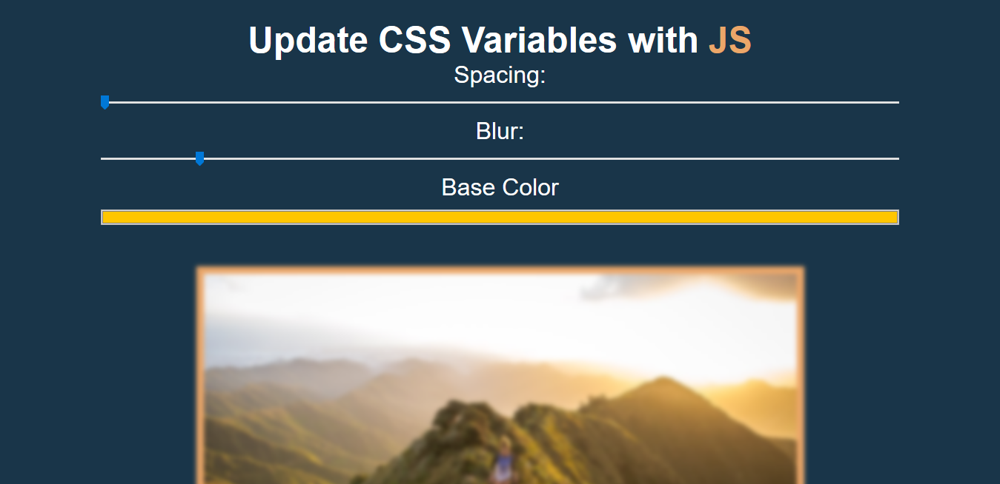

# Day 03 - Playing with CSS Variables and JS - WesBos Challenge ✅

**Date:** 04/29/2020

I loved it! 😍



## About HTML

I learned about how to use 02 new tags:

The [range input](https://www.w3schools.com/tags/att_input_type_range.asp) tag, which define a range control. On this case [10, 200]:

```html
<input type="range" min="10" max="200" >
```

The [color input](https://www.w3schools.com/tags/att_input_type_color.asp) tag, which defines a color picker:

```html
<input id="base" type="color" name="base" value="#ffc600">
```

## About JavaScript

Wes used the CSS Variables to manipulate the HTML tags values. 

On the HTML tags, he set the property `data-sizing` with `px` unit:

```html
    <input type="range" data-sizing="px">
```

And he used it to create a suffix, which it's used to specify the unit values:

```javascript
    const suffix = this.dataset.sizing;
```

Then he used the `setProperty()` to set CSS properties and change the variables values using String Template:

```javascript
    document.documentElement.style
    .setProperty(`--${this.name}`, this.value + suffix);
```

You can see and to interact with the final result [here](https://vanribeiro-30daysofjavascript.netlify.app/challenge-files/03%20-%20css%20variables/). 😉

That's all folks! 😃

Thanks [WesBos](https://github.com/wesbos) to share this with us! 😊💖

---

written by [@vanribeiro](https://github.com/vanribeiro).