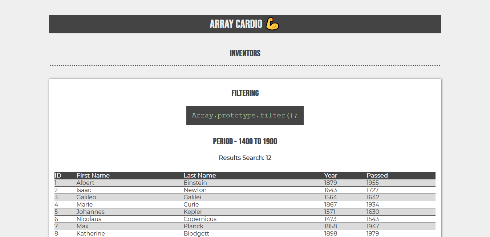

# Day 04 - Array Cardio Day 01 💪 ✅

**Date:** 04/30/2020 - 05/02/2020

I loved it! 😍 I learned many things about array methods in JS! 💪



## About HTML and CSS

On this day, we didn't have HTML and CSS. But just because I wanted to see the output on my browser viewport, I coded an HTML and I learned about how to create dynamic tables using JavaScript. But this is a subject to another day.

## About JavaScript

We did a lot of array gym exercises! 💪

### Filtering Things!

Wes started with `Array.prototype.filter()`.

According [MDN](https://developer.mozilla.org/en-US/docs/Web/JavaScript/Reference/Global_Objects/Array/filter):

> The [`filter()`](https://developer.mozilla.org/pt-BR/docs/Web/JavaScript/Reference/Global_Objects/Array/filter) method creates a new array with all elements that pass the test implemented by the provided function.

Here, Wes used it to determine what inventor was born in a period of years:

```javascript
const fifteen = (inventors) => {
    return inventors.filter(inventor =>
    (inventor.year >= 1500 && inventor.year < 1600 ));
}
``` 

This returns a list of objects for us about the inventors who lived on that period.

### Mapping Things

After, we mapped things using `Array.prototype.map()`.

According [MDN](https://developer.mozilla.org/pt-BR/docs/Web/JavaScript/Reference/Global_Objects/Array/map):

>The [`map()`](https://developer.mozilla.org/pt-BR/docs/Web/JavaScript/Reference/Global_Objects/Array/map) method creates a new array populated with the results of calling a provided function on every element in the calling array.

```javascript
const fullNames = (inventors) => {
    return inventors.map(inventor => (`${inventor.first} ${inventor.last}`));
}
```

This returns a list of the all inventors' full name.

### Reducing Things

After, Wes reduced an object array with `Array.prototype.reduce()`.

Here I had some problem. My function didn't work... 😰😢😅 I don't why yet. When it run, I always receive `undefined`... 🤷 This is a function used by him:

```javascript
    const totalYears = inventors.reduce((total, inventor) => {
      return total + (inventor.passed - inventor.year);
    }, 0);
```

This function finds the inventor age, sums them and returns the total. 

I wanna try to solve it later... But in another exercise I understand how to use `reduce()` and there it worked! 😁

### Sorting Things

After, Wes ordered an object array with `Array.prototype.sort()`.

According to the [MDN](https://developer.mozilla.org/pt-BR/docs/Web/JavaScript/Reference/Global_Objects/Array/sort):

> The [`sort()`](https://developer.mozilla.org/pt-BR/docs/Web/JavaScript/Reference/Global_Objects/Array/sort) method sorts the elements of an array in place and returns the sorted array. The default sort order is ascending, built upon converting the elements into strings, then comparing their sequences of UTF-16 code units values

The aim here was to order the inventor by was born year.

```javascript
const sortByYear = (inventors) => {
   return inventors.sort((x, y) => x.year > y.year ?  1 :  -1);
}
```

This function compares the `x.year` with `y.year` to what of them is bigger than other. If it's true returns `1`. If false it's return `-1`. 

Reading [MDN site](https://developer.mozilla.org/en-US/docs/Web/JavaScript/Reference/Global_Objects/Array/sort) about it, I understood this numbers on this way:

If we have this function format:

```javascript
function compareFunction(x, y){
    if(x < y) return -1;
    if(x === y) return 0;
    if(x > y) return 1;
}
```

- `x < y` - it returns `1` and `x` is sorted to an index lower than of the `y` position. (`x` comes first than `y`).
- `x == y` - it returns `0` and this element isn't moved of the current index position.
- `x > y` - it returns `-1` and `x` is sorted to an index greater than of the `y` position. (`x` comes first than `y`).

### Trying to Do Something Nice

Searching about it and because I wanted to see the results on the browser viewport, I started to learn and understand about how to use `reduce()` method! 

According to [MDN](https://developer.mozilla.org/en-US/docs/Web/JavaScript/Reference/Global_Objects/Array/Reduce):

> The [`reduce()`](https://developer.mozilla.org/en-US/docs/Web/JavaScript/Reference/Global_Objects/Array/Reduce) method executes a reducer function (that you provide) on each element of the array, resulting in a single output value.

Using an example of [MDN site brazilian translation](https://developer.mozilla.org/pt-BR/docs/Web/JavaScript/Reference/Global_Objects/Array/Reduce), I rewrote an Wes code:

```javascript
function reduceTransportsWay(transportations){
    return transportations.sort().reduce((init, current) => {
        if( init.length === 0 || init[init.length -1] !== current){
            init.push(current);
        }
        return init;
    }, []);
}
```

The aim here is to show the list without way transportations redundants . And this function will return for us a new array with unique elements. On my poor understanding, this is what happens here:

- First we `sort()` the array. Like we don't determine an argument, the array is ordered by default ascending. After we `reduce()` the array elements using:
  - a call back passes the `init` and `current` arguments that we use to test and remove the duplicates elements.
  - we compare the `init`, which here represents the accumulator, with `current`, which here represents the current array. If the `init` length is equal to `0` or equal to last `init` position `-1` and different of current array, it adds that element from array using the [`push()`](https://developer.mozilla.org/en-US/docs/Web/JavaScript/Reference/Global_Objects/Array/push) method in a new array, with unique elements.


## Conclusion

I learned many new things here. It took me three days to finish this Array Cardio. 😅 But I'm very happy with this! 

You can see final result [here](https://vanribeiro-30daysofjavascript.netlify.app/challenge-files/04%20-%20array%20cardio%20day%201/). 😃😉😍

That's all folks! 😃

Thanks [WesBos](https://github.com/wesbos) to share this with us! 😊💖

---

written by [@vanribeiro](https://github.com/vanribeiro).