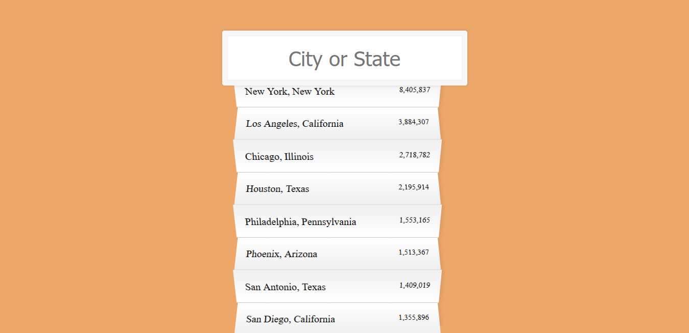

# Day 06 - Type Ahead ✅

**Date:** 05/04/2020



## About HTML and CSS

I didn't do any change here... Except the background color and highlight color. 😊😅

## About JavaScript

Wes used [`fetch()`](developer.mozilla.org/en-US/docs/Web/API/Fetch_API/Using_Fetch) to get data from a `JSON` file like an API. According to [MDN](developer.mozilla.org/en-US/docs/Web/API/Fetch_API/Using_Fetch):

> The Fetch API provides a JavaScript interface for accessing and manipulating parts of the HTTP pipeline, such as requests and responses. It also provides a global [`fetch()`](developer.mozilla.org/en-US/docs/Web/API/Fetch_API/Using_Fetch) method that provides an easy, logical way to fetch resources asynchronously across the network.

This is Wes `fetch()` code:

```javascript
const endpoint = 'https://gist.githubusercontent.com/Miserlou/c5cd8364bf9b2420bb29/raw/2bf258763cdddd704f8ffd3ea9a3e81d25e2c6f6/cities.json';

const cities = [];

fetch(endpoint)
    .then(blob => blob.json())
    .then(data => cities.push(...data));
```

I need to confess you that for me is really difficult to understand JS Promisses. But after this example, reading the MDN definition and doing this example using `XMLHttpRequest()` I think I'm starting understand it.

As we can see the `endpoint` variable is an URL that points to the `cites.json` file. Wes passed it as argumunt in `fetch()`:

```javascript
fetch(endpoint)
```
After, He decided what `response` type he wanted and its format. Here, he chose the `.json()`, but, according to [MDN](https://developer.mozilla.org/en-US/docs/Web/API/WindowOrWorkerGlobalScope/fetch), if wanted read an image, for example, I could use `blob()`. (Not all browsers offer support to the `blob()`):

```javascript
    .then(blob => blob.json())
```

And then, finally, he chose what he wanted to do with this datas. He storaged in an array, using `push()` method.

```javascript
    .then(data => cities.push(...data));
```

It's important to understand that Fetch API is new feature on the browser, which means it may not works in some old browser. Then, [as it recommended by MDN site](https://developer.mozilla.org/en-US/docs/Web/API/Fetch_API/Using_Fetch),  we can write an `XMLHttpRequest()` condiotinally:

```javascript
if(window.fetch){
    // do fetch things
} else {
    // do XMLHttpRequest things
}
```

I decided to add an `XMLHttpRequest()`. This is my code: 

```javascript
    const request = new XMLHttpRequest();
    request.open('GET', endpoint);
    request.responseType = "json";
    request.send();
    request.onload = () => {
        const data = request.response;
        cities.push(...data);
    }
```


## Conclusion

Learn about it was really interesting! I'm going to use in another challenge not finished! 😊💖

You can see final result [here](https://vanribeiro-30daysofjavascript.netlify.app/challenge-files/06%20-%20type%20ahead/). 😃😉😍

That's all folks! 😃

Thanks [WesBos](https://github.com/wesbos) to share this with us! 😊💖

---

written by [@vanribeiro](https://github.com/vanribeiro).