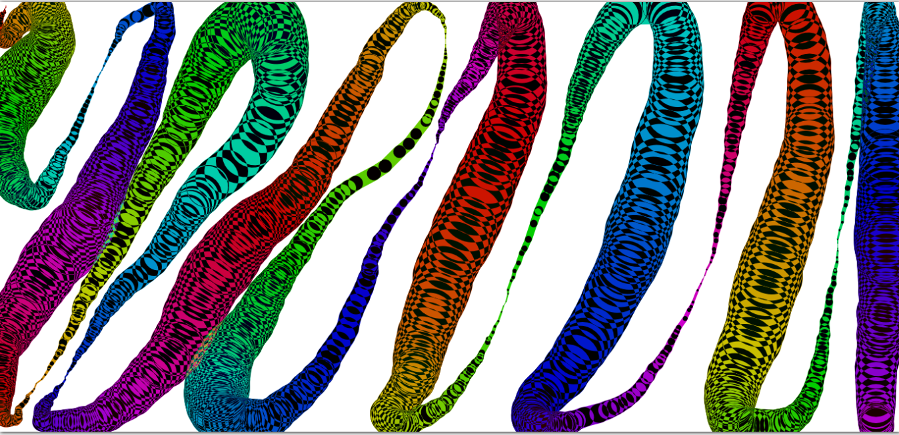

# Day 08 - Fun with HTML5 Canvas ✅

**Date:** 05/09/2020



## About HTML and CSS

I just created a single page with instruction about how to use the draw `<canvas>` area.

## About JavaScript

I had used `<canvas>` before. But I learned and reviewed somethings.

### Canvas

Canvas is an HTML5 element for graphics that we can manipulate using the JavaScript. According to [w3School](https://www.w3schools.com/html/html5_canvas.asp):

> The HTML `<canvas>` element is used to draw graphics on a web page.

Wes created a function to draw on canvas container. Briefly, to draw with canvas, thinking about this challenge, we need to:

- select the `<canvas>` element
- get the the context
- choose one color
- choose a line type
- determine how to draw it.

Here, we have the function Wes coded to draw in canvas:

```javascript
function draw(e) {
    if(!isDrawing) return;
    context.strokeStyle = `hsl(${hue}, 100%, 40%)`;
    context.beginPath();
    context.moveTo(lastX, lastY);
    context.lineTo(e.offsetX, e.offsetY);
    context.stroke();
    [lastX, lastY] = [e.offsetX, e.offsetY];
    hue++;
    if(hue >= 360){
        hue = 0;
    }

    if(context.lineWidth >= 100 || context.lineWidth <= 1){
        direction = !direction;
    }

    if(direction){
        context.lineWidth++;
    } else {
        context.lineWidth--;
    }
}
```

Here:
- This function basically use the mouse coordinates passed by the event listener to determine where the JavaScript is going to the draw the lines.
- A nice thing what Wes coded is about the HSL color circle. He used this circle to make the colors of line change dynamically. He limited the `hue` (degrees) using the condition to say to this variable that if it goes up to the 360deg the hue value is set to the 0;
- By last, he created conditions to change the width line dynamiclly.

#### Mouses Event Listeners

I learned about `mouse` listener today:

- `mousedown`: when the mouse is clicked down;
- `mousemove`: when the mouse is moved;
- `mouseup`: when the mouse button is released;
- `mouseout`: when the mouse is out of an element.


### Global Composite Operation

We can apply some effects on the context. On this `README.md` corver I applied the `difference` type composite operations:

```javascript
context.globalCompositeOperation = 'difference';
```

## Conclusion

I had a lot of fun with this exercise! 😊💖

You can see final result [here](https://vanribeiro-30daysofjavascript.netlify.app/challenge-files/08%20-%20fun%with%20html5%20canvas/). 😃😉😍

That's all folks! 😃

Thanks [WesBos](https://github.com/wesbos) to share this with us! 😊💖

---

written by [@vanribeiro](https://github.com/vanribeiro).