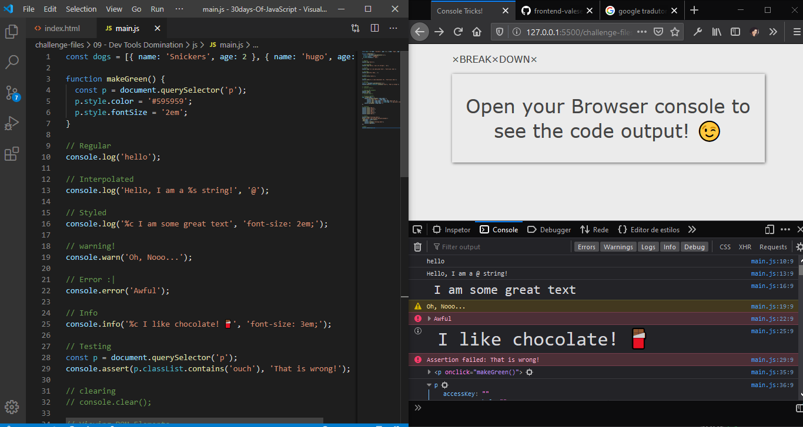

# Day 09 - Dev Tools Domination ✅

**Date:** 05/11/2020

## About HTML and CSS

Today I didn't put my focus on HTML and CSS. Just on JavaScript! 😁

## About JavaScript

Today I learned different ways to use the Browser console besides then `console.log()` and `console.table()`. You can see the complete code [here](/js/main.js). 

## Conclusion

I had a lot of fun with this examples! 😊💖

You can see final result [here](https://vanribeiro-30daysofjavascript.netlify.app/challenge-files/09%20-%20dev%20tools%20domination/)). 😃😉😍

That's all folks! 😃

Thanks [WesBos](https://github.com/wesbos) to share this with us! 😊💖

---

written by [@vanribeiro](https://github.com/vanribeiro).
