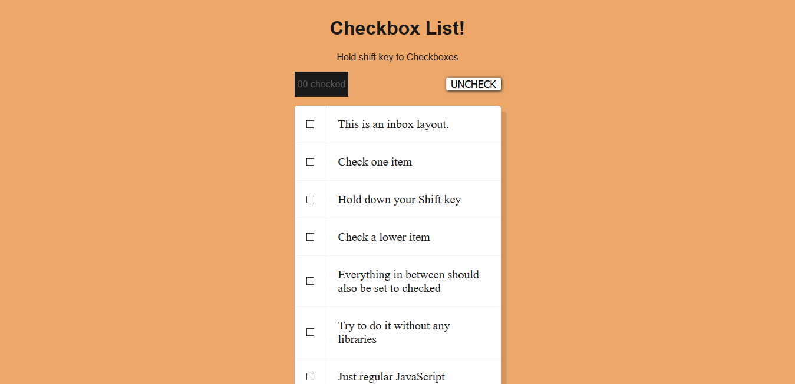

# Day 10 - Hold Shift to Check Multiple Checkboxes ✅

**Date:** 05/12/2020



## About HTML and CSS

I did some changes on this CSS challenge. And I created somethings that I would like to try.  😁

## About JavaScript

On this day, Wes tried to recreate an e-mail inbox what allows us to select multiple checkboxes.

The new property I learned here is about the `shift key`, which we can use together with mouse button:

```javascript
if(e.shiftKey & this.checked){
    //more code goes here
}
```

He created a function to handle the checks. This function do something like this:
- Verify if the `shift key` and mouse button is pressed, when the mouse is clicked.
- Then the checkbox array is gone through and new validation is done:
    - if the `checkbox` element is equal to the current event or the last checkbox the `inBetween` variable is "denied", which means the value in updated to `true`.
    - and if the `inBetween` variable is `true` all these checkboxes are checked with true value and these are selected.


## About my modifications

I created a button called `UNCHECK`, which clear the list and an accounter to count the checkboxes selected.

Now I'm trying to adapt this code to mobile. 😊


## Conclusion

I'm in love with this activity! 😊💖

You can see final result [here](https://vanribeiro-30daysofjavascript.netlify.app/challenge-files/10%-%20hold%20shift%20and%20check%20checkboxes/)). 😃😉😍

That's all folks! 😃

Thanks [WesBos](https://github.com/wesbos) to share this with us! 😊💖

---

written by [@vanribeiro](https://github.com/vanribeiro).