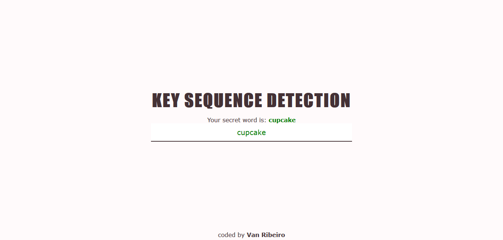

# Day 12 - Key Sequence Detection ✅

**Date:** 05/14/2020

## About HTML and CSS

Some tags to create new features!

## About JavaScript

I learned about cool things here but I didn't have time to write here again. Sorry... 

I'll try to do it on the next days! 😊

## About my modifications

Adapting the Wes code, I tried to do a kind of key words detection.

## Conclusion

This activity is was really funny! 😊💖

You can see final result [here](https://vanribeiro-30daysofjavascript.netlify.app/challenge-files/12%20-%20key%20sequence%20detection/)). 😃😉😍

That's all folks! 😃

Thanks [WesBos](https://github.com/wesbos) to share this with us! 😊💖

---

written by [@vanribeiro](https://github.com/vanribeiro).