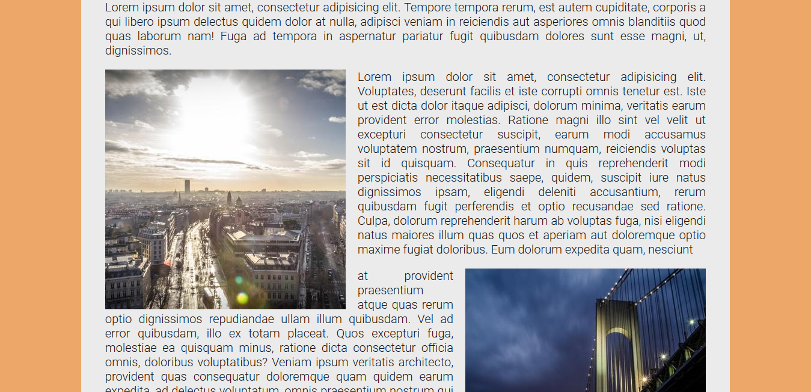

# Day 13 - Slide in Scroll ✅

**Date:** 05/15/2020

## About HTML and CSS

I just did some adjusment to make this responsiveness.

## About JavaScript

(I need to write about it...)

## Conclusion

I like this kind of effect and I always wanted to know to do it. 😊💖

You can see final result [here](https://vanribeiro-30daysofjavascript.netlify.app/challenge-files/13%20-%20Slide%20in%20on%20Scroll/)). 😃😉😍

That's all folks! 😃

Thanks [WesBos](https://github.com/wesbos) to share this with us! 😊💖

---

written by [@vanribeiro](https://github.com/vanribeiro).