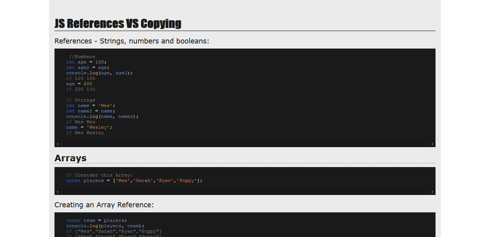

# Day 14 - JS References vs Copying ✅

**Date:** 05/17/2020

## About HTML and CSS

I created a simple page to take some code notes using the tags `<pre>` and `<code>`.

## About JavaScript

My notes are on the [`index.html`](./index.html) page of this page. If you wanna something more readable version, you do it in [this site](https://vanribeiro-30daysofjavascript.netlify.app/challenge-files/14%20-%20javascript%20reference%20vs%20copying/).

## Conclusion

I have a lot of things to learn about it. 😊💖

You can see final result [here](https://vanribeiro-30daysofjavascript.netlify.app/challenge-files/14%20-%20javascript%20reference%20vs%20copying/)). 😃😉😍

That's all folks! 😃

Thanks [WesBos](https://github.com/wesbos) to share this with us! 😊💖

---

written by [@vanribeiro](https://github.com/vanribeiro).