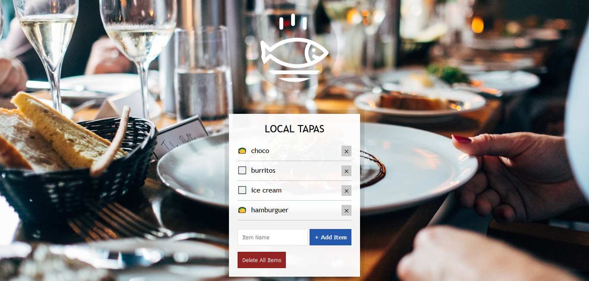

# Day 15 - LocalStorage ✅

**Date:** 05/18/2020

## About HTML and CSS

I just did some modification to add new buttons.

## About JavaScript

Sorry... No notes today. I spent a lot time working on it and trying to discover how to solve a specific problem... 😅

## Conclusion

I have a lot of things to learn about it and I wanna do some improviments here. 😊💖

You can see final result [here](https://vanribeiro-30daysofjavascript.netlify.app/challenge-files/15%20-%20LocalStorage/index.html)). 😃😉😍

That's all folks! 😃

Thanks [WesBos](https://github.com/wesbos) to share this with us! 😊💖

---

written by [@vanribeiro](https://github.com/vanribeiro).