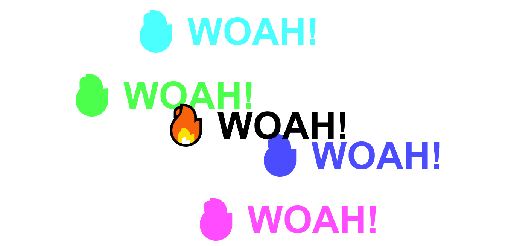

# Day 16 - Mouse Move Shadow ✅

**Date:** 05/19/2020

## About JavaScript

We work with mouse event and calculate the position to give shadow to the mouse move.

## Conclusion

It was really funny this class challenge. 😊💖

You can see final result [here](https://vanribeiro-30daysofjavascript.netlify.app/challenge-files/16%20-%20mouse%20move%20shadow)). 😃😉😍

That's all folks! 😃

Thanks [WesBos](https://github.com/wesbos) to share this with us! 😊💖

---

written by [@vanribeiro](https://github.com/vanribeiro).