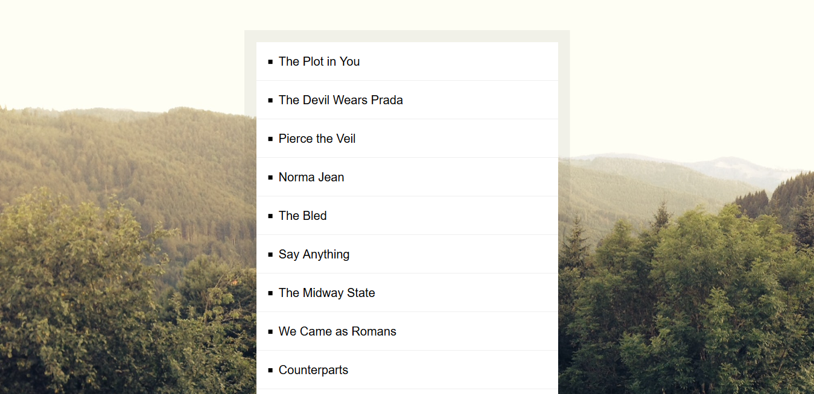

# Day 17 - Sort Without Articles ✅

**Date:** 05/21/2020

## About JavaScript

Today class, Wes sorted an array not considering the English articles (a/an/the _) on the begining band names title.

Sorry, I'm not writting more here. I'm little busy on this days.

## Conclusion

Like others class I had here, really useful lesson! 😊💖

You can see final result [here](https://vanribeiro-30daysofjavascript.netlify.app/challenge-files/16%20-%20mouse%20move%20shadow)). 😃😉😍

That's all folks! 😃

Thanks [WesBos](https://github.com/wesbos) to share this with us! 😊💖

---

written by [@vanribeiro](https://github.com/vanribeiro).