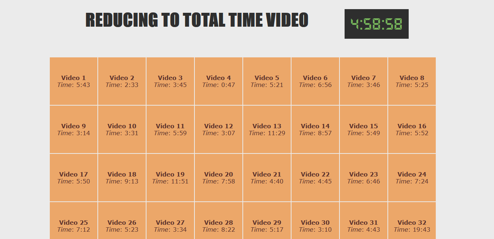

# Day 18 - Adding Up Times with Reduce ✅

**Date:** 05/22/2020

## About JavaScript

Today I learned a little bit more about how to use `reduce()` and `map()` together to some the sum of all time video.

Sorry, I'm not writting more here. I'm little busy on this days.

## Conclusion

Like others class I had here, really useful lesson! 😊💖

You can see final result [here](https://vanribeiro-30daysofjavascript.netlify.app/challenge-files/18%20-%20adding%20up%20times%20with%20reduce/). 😃😉😍

That's all folks! 😃

Thanks [WesBos](https://github.com/wesbos) to share this with us! 😊💖

---

written by [@vanribeiro](https://github.com/vanribeiro).