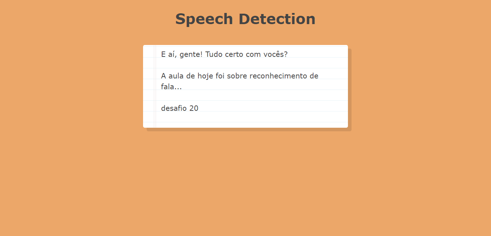

# Day 20 - Speech Detection ✅

**Date:** 05/26/2020

## About JavaScript

Sorry, I'm not writing more here. I'm little busy on this days. But I wanna to come back here to take some notes!

## Conclusion

I had a lot of fun with this class! 💖

You can see final result [here](https://vanribeiro-30daysofjavascript.netlify.app/challenge-files/20%20-%20speech%20detection/). 😃😉😍

That's all folks! 😃

Thanks [WesBos](https://github.com/wesbos) to share this with us! 😊💖

---

written by [@vanribeiro](https://github.com/vanribeiro).