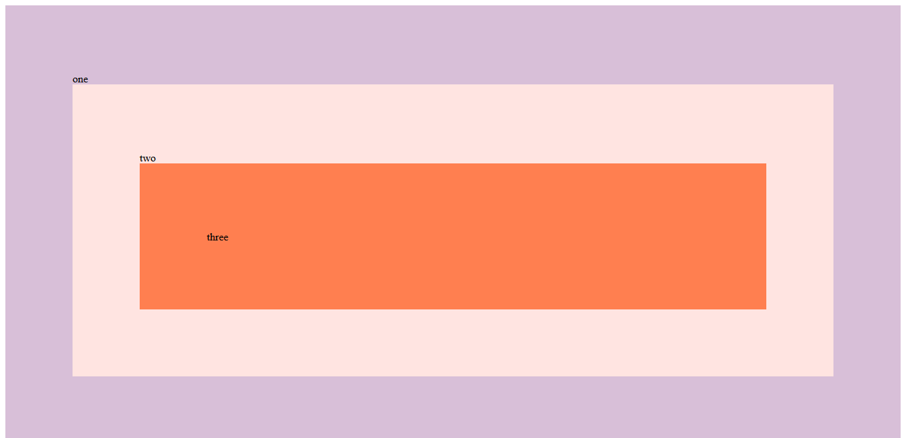

# Day 25 - Event Capture, Propagation, Bubbling and Once ✅

**Date:** 05/31/2020

## About JavaScript

**Bubble** - when the event propagates from son element to father element (down to up). The most of the JavaScript events can bubble.

**Capture** - when the event propagates from father element to son element (up to down). By default the `capture` is set with `false`. To see this working is necessary to set it with `true`.

**Propagation** - it's possible to stop propagation using `event.stopPropagation()`.

**Once** - allows to execute the event one time if is set with true. In this case, `capture` needs to be `false`.

## Conclusion

Very useful class! 💖

You can see final result [here](https://vanribeiro-30daysofjavascript.netlify.app/challenge-files/24%20Sticky%20Nav/). 😃😉😍

That's all folks! 😃

Thanks [WesBos](https://github.com/wesbos) to share this with us! 😊💖

---

written by [@vanribeiro](https://github.com/vanribeiro).