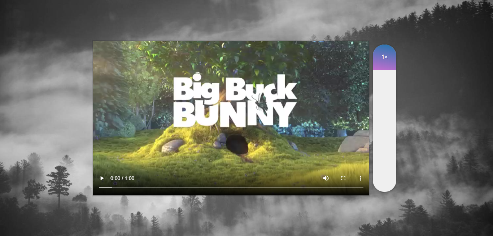

# Day 28 - Video Speed Controller ✅

**Date:** 06/03/2020

## About JavaScript

I spent a good part of time trying to solve the responsiveness... Soon as possible I want to make my attempt code a little bit more DRY.

No notes today, guys... Sorry! 😅 

## Conclusion

Very nice class! 💖

You can see final result [here](https://vanribeiro-30daysofjavascript.netlify.app/challenge-files/28%20-%20Video%20Speed%20Controller/). 😃😉😍

That's all folks! 😃

Thanks [WesBos](https://github.com/wesbos) to share this with us! 😊💖

---

written by [@vanribeiro](https://github.com/vanribeiro).